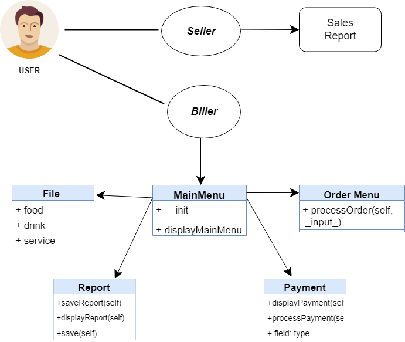

# **Food Ordering System**
*Food Ordering System is a system that deals with the menu and payment orders. It aims to help the user to manage their orders and payment easily. The highlight of this system is the convenience for them to order.*

## FEATURES
    - Ordering
    - Payment
    - Sales Report 
    
## **UML (Unified Model Language)**

# **Self Assesment**

| Metric                     |       Score        | Explanation                                                                |
|--------------------------  | ------------------ | ---------------------------------------------------------------------------|
| CODE REUSABILITY           | 2                  | A Bit of DRY method exists but still inhibits several repeats.             |
| MAINTABILITY               | 3                  | The program's structure is based on OOP principles. Codes are readable, understandable,aiding to its maintainability                      |
| SCALABILITY                | 3                  | THe program can be easilt updated in case feature add=ons and immediate tweaks.          |
| EXECUTION                  | 3                  | The program works completely as intended and declared. Errors are handled properly. |
| ORIGINALITY                | 3                  | Concept is quite similar to some samples |
| OVERALL IMPRESSION         | 4                  | Minimal to no bugs or errors found during presentation. The overall quality and creativity are good |

## 🔗 Links
https://www.youtube.com/@luffysOS

## Authors

<h1 align="center">Hi 👋, I'm Princess Ann Geguillan</h1>
<h3 align="center">A passionate 2nd Year Student</h3>
  

- 🌱 I’m currently learning **Object-Oriented Programming**

- 👨‍💻 All of my projects are available at [https://github.com/GeguillanAnn](https://github.com/GeguillanAnn)

- 📫 How to reach me **21-04797@g.batstate-u.edu.ph**

<h3 align="left">Connect with me:</h3>

<h3 align="left">Languages and Tools:</h3>

    

<h1 align="center">Hello there, I am Angel Faye M. Andal</h1>
<h3 align="center">A 2nd Year BSIT Student</h3>
  

- 🌱 I’m currently learning new things to help me in the future

- 💞️ I’m looking forward to improve my skills in coding

- 📫 You can reach me through my gsuite **21-02300@g.batstate-u.edu.ph**
     
<h3 align="left">Languages and Tools:</h3>

    

<h1 align="center">Hi, I'm Jimmy Jr. I. Calahati</h1>
<h3 align="center">A 2nd Year BSIT Student from Batangas State University</h3>

  

  
  
  

- 🌱 I’m currently learning **Object-Oriented Programming**

- 📫 How to reach me: **21-02717@g.batstate-u.edu.ph**

- ⚡ Fun fact: **I think I'm funny**

<h1 align="center">Hello, I'm Joshua Dominic M. Arabe</h1>
<h3 align="center">BSU 2nd Year BSIT Student</h3>
  

- 🌱 I’m currently learning **Object-Oriented Programming**

- 📫 You can reach me through my gsuite **21-01687@g.batstate-u.edu.ph** 

- ⚡ **Still Learning**

<h3 align="left">Languages and Tools:</h3>

    

